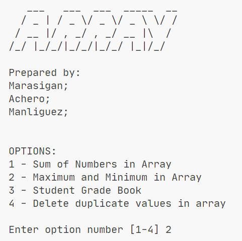

# Array Pre-test

> This is a catch up group activity on our **Data Structures and Algorithm** course regarding array manipulation.

## Objectives

- Sum of Numbers in Array
- Maximum and Minimum in Array
- Student Grade Book
- Delete duplicate values in array

## Highlighted Activity

> BSCS2_Marasigan_Achero_Manliguez_Array.java

### Special Thanks to my Groupmates

- <a href="https://github.com/NorielAchero">Noriel Achero</a>
- <a href="https://github.com/AngelicaManliguez">Angelica Mae Manliguez</a>
