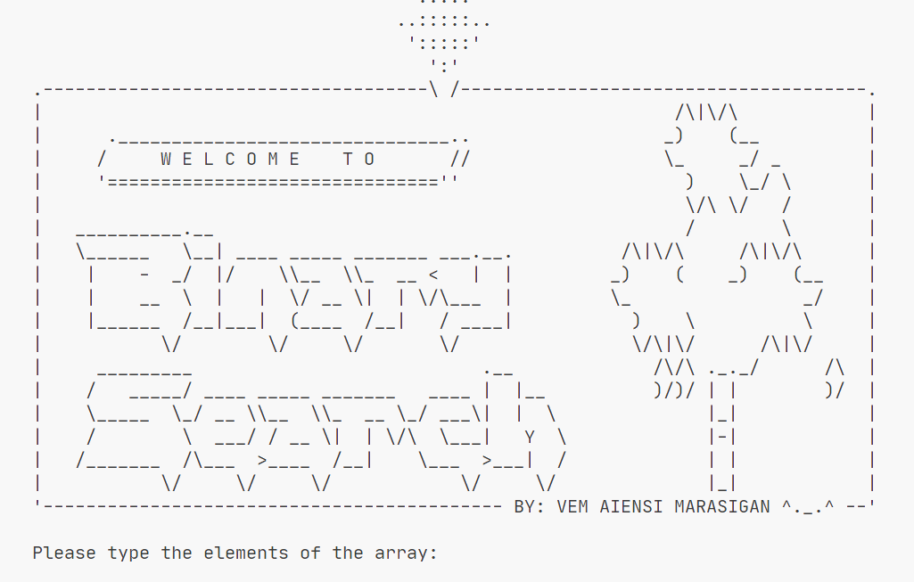

# Binary Search

> A fast search algrotithm which describes how divide and conquer work. Divides the set/array into two and then comparing the item being search wether it falls either on one of the partitions. This loops until the item finds it matching value

> Note:_I created **Tools.java** here for presentation/styling purposes_

## Objectives

1. Sorts the input array first
2. Loops the Binary search algorithm

## Output

