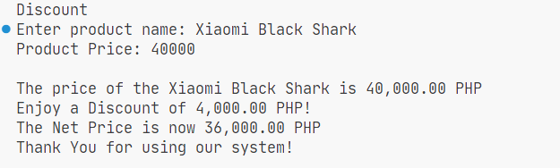

# Conditional Statements

> One of the biggest foundations of my programming life. This defines what happens based on your solution's logic through conditions.

## Objectives

- Learn more about booleans
- Create conditions
- Use IF, ELSEIF and ELSE

## Sample Output

> SalesDiscount.java

