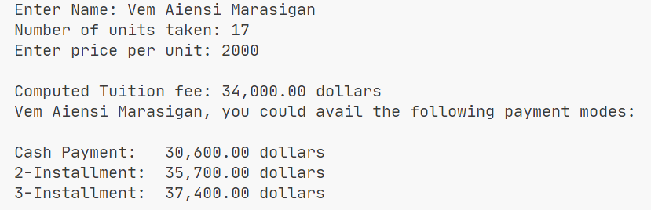

# Input Output

> Learning how inputs are processed and describes the flow of a procedural event

## Objectives

- Use Scanner for Input
- Handle Input
- Input Processing and Output

## Sample Output

> Tuition.java

