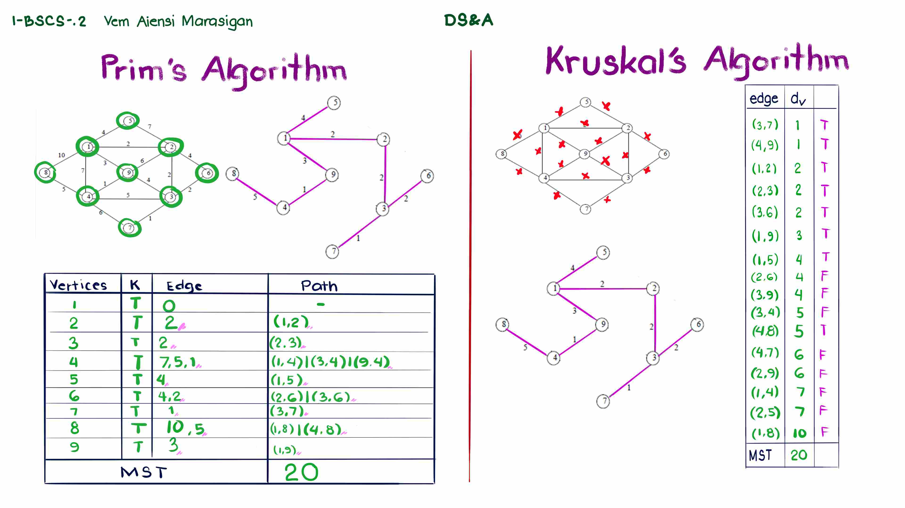

# Prim's and Kruskal Algorithm

> We learned about **Minimum Spanning Tree** which is a subgraph, from a wieghted undirected graph, that connects all vertices without cycles and has the minimum total edge weight. These algorithms are used to find the **MST**

**Prim's Algorithm:**

- **Approach:** Starts with an arbitrary vertex and grows the MST by repeatedly adding the edge with the smallest weight that connects a vertex in the MST to a vertex outside the MST.
- **Data Structure:** Typically uses a priority queue to store the edges with their weights, allowing for efficient retrieval of the minimum weight edge.
- **Time Complexity:**
  - O(V^2) with an adjacency matrix representation.
  - O(E log V) with a priority queue (e.g., Fibonacci heap), where V is the number of vertices and E is the number of edges.
- **Advantages:**
  - Can be simpler to implement than Kruskal's algorithm.
  - Generally faster for dense graphs (where E is close to V^2).
- **Disadvantages:**
  - Can be slower for sparse graphs (where E is much smaller than V^2).

**Kruskal's Algorithm:**

- **Approach:** Starts with all vertices as separate trees and repeatedly adds the edge with the smallest weight that connects two different trees, ensuring no cycles are formed.
- **Data Structure:** Uses a disjoint-set data structure (e.g., Union-Find) to efficiently track the connected components.
- **Time Complexity:** O(E log V) using a disjoint-set data structure.
- **Advantages:**
  - Generally faster for sparse graphs.
  - Can handle disconnected graphs (it will find the MST for each connected component).
- **Disadvantages:**
  - Can be more complex to implement than Prim's algorithm due to the need for cycle detection.

**Key Differences:**

| Feature         | Prim's Algorithm                                                         | Kruskal's Algorithm                            |
| --------------- | ------------------------------------------------------------------------ | ---------------------------------------------- |
| Starting Point  | Arbitrary vertex                                                         | All vertices as separate trees                 |
| Edge Selection  | Smallest edge connecting a vertex in the MST to a vertex outside the MST | Smallest edge connecting two different trees   |
| Cycle Detection | Implicit (no cycles are formed by the algorithm's construction)          | Explicit (using a disjoint-set data structure) |
| Data Structure  | Priority queue                                                           | Disjoint-set data structure                    |
| Time Complexity | O(V^2) or O(E log V)                                                     | O(E log V)                                     |
| Graph Type      | Typically for connected graphs                                           | Can handle disconnected graphs                 |
| Performance     | Faster for dense graphs                                                  | Faster for sparse graphs                       |

**In Summary:**

- Prim's algorithm is generally preferred for dense graphs due to its simpler implementation and potentially faster performance.
- Kruskal's algorithm is generally preferred for sparse graphs and can handle disconnected graphs.

**Note:** _These information came from gemini and although helpful, our Professor's material is inside this directory as well._

## Here's my work I guess...

