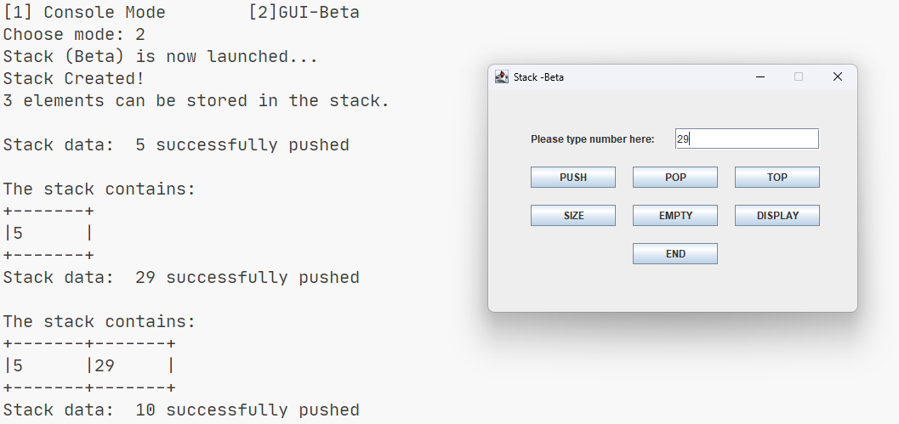

# Stacks

> Covers how stacks work and how it is applied to code

> This is probably my first time using java swing in compliance to our professor's challenge on not pressing the enter. It works but I guess it's not the intended work around ^\_<

## Objectives

- Push
- Pop
- Top
- Size
- Empty

## Sample Output

