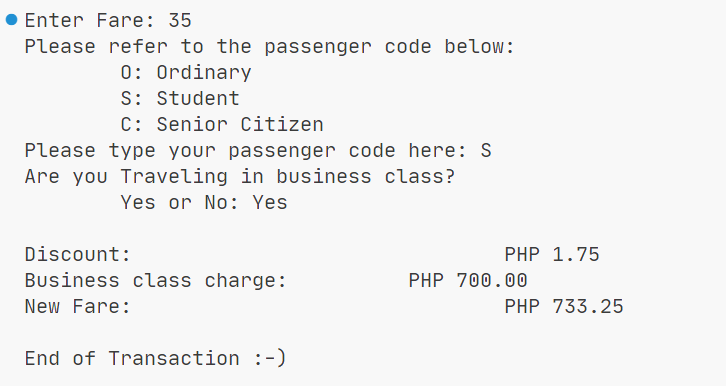

# Switch Case Statements

> Another way of using conditions other than IF-ELSE statements. With Switch cases, it is easier and much more readable where conditions will be met. However, it is quite limited only to the variable being checked unlike IF-ELSE statements that are flexible enough to use different conditional statements.

## Objectives

- Differentiate IF to Switch Case
- Create different Cases and Defaults

## Sample Output

> Fare.java

