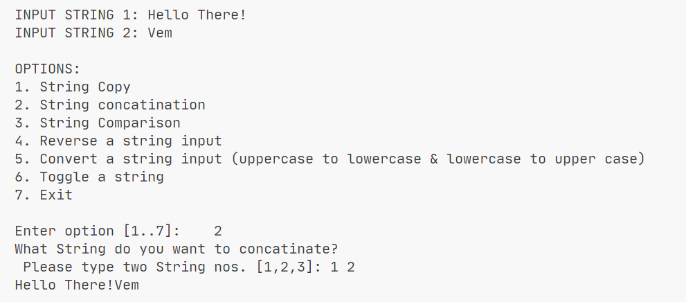

# Introduction B | String Manipulation

> Continuation of Introduction A but particularly more about Strings.

## Objectives

- String Copy/Duplication
- Concatenation
- Comparison
- Reversing a String
- Uppercasing and Lowercasing
- Case Toggling

## Sample Output

> BSCS2_Marasigan_IntroductionB.java

