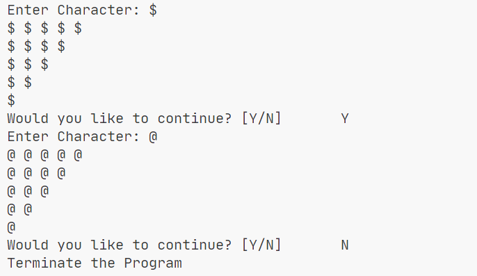

# Loops

> One of the essential fundamentals of programming. This incorporates the use of loops in execution rather than writing a code block in a repetitive manner.

## Objectives

- While
- Do-While
- For

## Highlighted Activity

> NestedLoopAssignment.java

